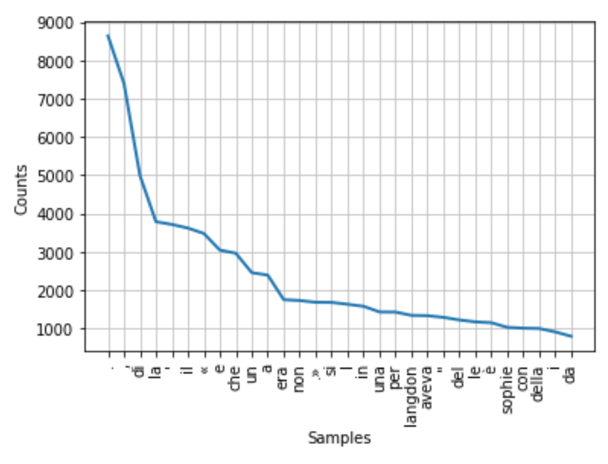
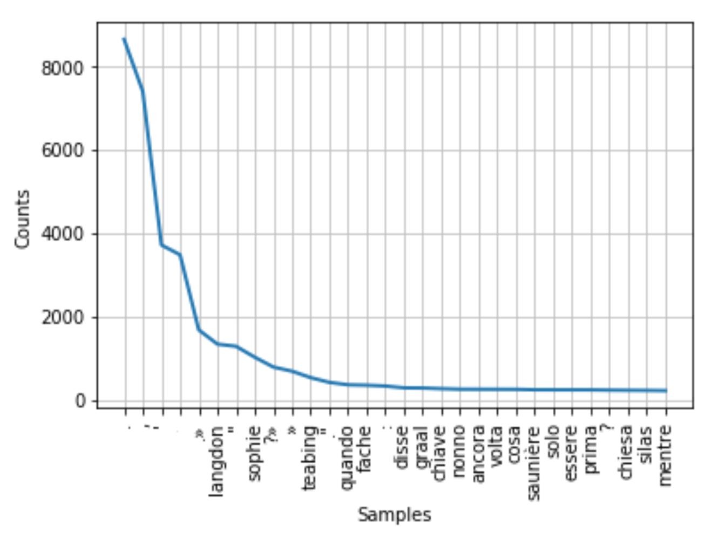
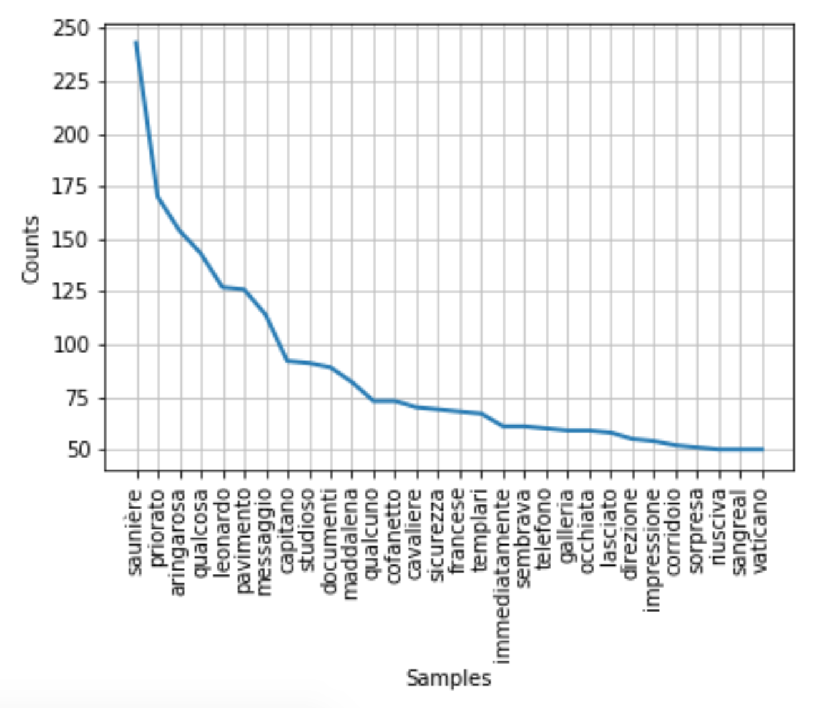
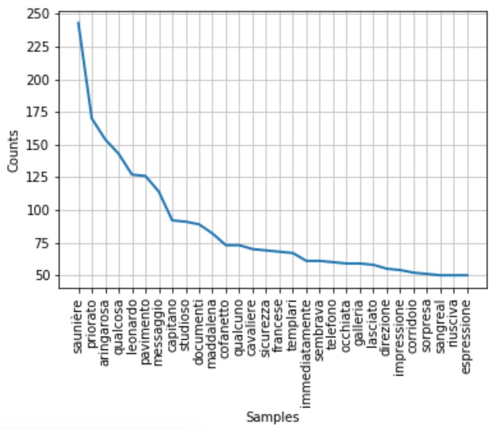

# Python perlinguisti parte 3: NLTK

Nltk (acronimo per **Natural Language Toolkit** ) è una libreria python che fornisce moltissimi
stumenti per l'analisi e la manipolazione di dati testuali.
Prima di tutto si crea un nuovo file python e si specifica a inizio file:

```python
import nltk
```

Il comando serve a importare il modulo nltk _in toto_.
Per leggere testi in locale (quindi testi salvati sul pc) si usando i metodi `open()` e `read()`.

```python
f = open('davinci.txt','r')
miofile = f.read()
```

A questo punto è buona regola normalizzare il testo convertendo tutto in lettere minuscole, in modo di non avere statistiche falsate nelle analisi successive. Ovviamente la normalizzazione non va operata se la distinzione tra lettere minuscole e maiuscole ha una rilevanza nelle analisi che vogliamo effettuare sul testo.
Per normalizzare si usa la funzione `lower()` che converte tutti i caratteri in minuscolo:

```python
miofilenorm = miofile.lower()
```

Ottenuto il file normalizzato è necessario operare un’ulteriore trasformazione per rendere i dati
processabili con i metodi di nltk. Il file va infatti trasformato in un oggetto `Text` (un tipo di oggetto “interno” di nltk che consente di effettuare tutte le operazioni viste sopra da shell interattiva). Per trasformare il file in oggetto Text si effettuano le seguenti operazioni:

```python
miotesto = nltk.wordpunct_tokenize(miofilenorm)
miotesto = nltk.Text(miotesto)
```

Si effettua controllo con il comando type

```python
print(type(miotesto))
```

se tutto è andato a buon fine la shell python ci informerà che si tratta di un oggetto di tipo `nltk.text.Text`.

```python
<class 'nltk.text.Text'>
```

Dunque il nostro file locale è stato “convertito” in un oggetto sul quale possono essere eseguiti tutti i metodi di nltk. Senza questa trasformazione qualsiasi operazione sarà impossibile.
Adesso è possibile effettuare le analisi testuali di base, come contare da quanti **token** è composto il testo.
Per contare il numero di token si usa il metodo `len()`:

```python
tokens = len(miotesto)
print('numero token', tokens)
```

```
numero token 173694
```

La prima line conta il numero di token da cui è composto il testo (ricordiamo che in questo momento per token si intende qualsiasi carattere separato da spazio o diviso da un segno di punteggiatura). La seconda linea semplicemente stampa a video il numero di token seguito dalla stringa numero token per rendere il risultato più leggibile.
Per calcolare il vocabolario del testo, ovvero il numero di **type** , e contarli, si usano i metodi `set()` e `len()`:

```python
vocab = set(miotesto)
#il numero di type costituisce il vocabolario di un testo
tipi = len(vocab)
print('numero parole-tipo', tipi)
```

```
numero parole-tipo 14359
```

Il comando `set()` “crea” l’insieme delle parole-tipo e col comando `len()`effettua il conteggio che viene successivamente stampato a video.

Una volta che sappiamo calcolare il numero di token e il numero di type, è facile iniziare ad ottenere delle metriche informative sul testo, la più semplice è la **type-token-ratio (TTR)**. La TTR fornisce informazioni sulla ricchezza lessicale mettendo in rapporto il numero di token (quindi le parole totali che compongono il testo) con il numero di type (quindi le parole
uniche).

Per calcolare la ricchezza lessicale è sufficiente dividere il numero di token per il numero di type, essendo entrambi stati calcolati precedentemente.

```python
#type-token-ratio
ttr = tipi/tokens
#stampa la type-token-ratio
print ('ricchezza lessciale: ',ttr)
```
```
ricchezza lessciale:  0.08266837081303902
```

Un'altra misura molto semplice da calcolare è l' **inverse type-token-ratio** , ovvero il rapporto inverso tra numero di token e numero di parole-tipo. Questo rapporto indica quante volte in media è stata usata ogni parola del testo:

```python
#inverse type-token-ratio
ittr = tokens/tipi
print ('ricchezza lessicale inversa: ',ittr)
```

```
ricchezza lessicale inversa:  12.096524827634237
```

Se vogliamo invece ottenere la percentuale con cui una determinata parola è usata è sufficiente
un semplice calcolo:

```python
parola = 'parigi'
occorrenze = miotesto.count(parola)
percentuale = 100 *occorrenze/tokens
print (percentuale)
```


Ovviamente per dare risultati validi sarà sempre necessario iniziare importando il modulo `nltk`, pertanto il codice completo per calcolare i token, le parole-tipo e le misure di ricchezza lessicale sarà il seguente:


```python
import nltk

#importa il file
f = open('davinci.txt','r')
miofile = f.read()

#normalizza il file
miofilenorm = miofile.lower()

#trasforma il file in oggetto Text
miotesto = nltk.wordpunct_tokenize(miofilenorm)
miotesto = nltk.Text(miotesto)

#calcola tokens e types
tokens = len(miotesto)
print ('numero token: ',tokens)

print ('-------')
# separatore per rendere più leggibile l'output

vocab = set(miotesto)
tipi = len(vocab)
print ('numero parole-tipo: ',tipi)

print ('-------')

#misure ricchezza lessicale
ttr = tipi/tokens
print ('ricchezza lessciale: ',ttr)

print ('-------')

ittr = tokens/tipi
print ('ricchezza lessicale inversa: ',ittr)

print ('-------')

#percentuale d'uso di una parola
parola = 'parigi'
occorrenze = miotesto.count(parola)
percentuale = 100 *occorrenze/tokens
print (parola,"è usata",percentuale,"volte in percentuale")
```

```
numero token: 173694
-------
numero parole-tipo: 14359
-------
ricchezza lessciale:  0.08266837081303902
-------
ricchezza lessicale inversa: 12.
-------
parigi è usata 0.048360910566858956 volte in percentuale
```

### Collocazioni

È possibile visualizzare le **collocazioni** , ovvero le parole all'interno del loro contesto, con un
buffer di n parole prima e dopo. Per fare ciò è sufficiente usare il metodo `concordance`.

```python
# input utente
parola = input('parola da visualizzare: ')

#collocazioni
conc = miotesto.concordance(parola)
print (conc)
```

```
parola da visualizzare: parigi
Displaying 25 of 84 matches:
he mai. prologo museo del louvre , <parigi> ore 22. 46 il famoso curatore del
odino. l ' università americana di <parigi> è lieta di presentare una serata
co
lio per chiamarla prima di lasciare <parigi> , martedì prossimo? grazie .» e
ri
delle luci. buon sonno al ritz di <parigi>. alzò la testa e fissò lo
specchio
hine dell ' università americana di <parigi> « il nostro ospite di questa sera
n
ella settimana , silas era ospite a <parigi> , ma da molti anni godeva della
ben
pensi. la chiave di volta è qui a <parigi> .» « parigi? incredibile. sembra
chiave di volta è qui a parigi .» « <parigi>? incredibile. sembra persino
trop...
```
## Distribuzioni di frequenza

Per creare una distribuzione di frequenza in nltk si usa il comando `nltk.FreqDist()`.

```python
fd=nltk.FreqDist(miotesto)
```

La distribuzione di frequenza di un testo si configura sempre come una
legge di potenza, con una distribuzione cosiddetta "a coda lunga".

```python
#creare il grafico per le 30 parole più frequenti
fd.plot( 30 )
```



C'è un altissimo numero di parole con frequenze estremamente basse e un insieme di parole molto molto ridotto che occorrono un numero altissimo di volte.
Le parole con frequenza più altra sono quelle dette semanticamente vuote (preposizioni, articili...), le parole meno frequenti saranno invece verbi e nomi.
Dalla distribuzione di frequenza che si ottiene si nota come venga rispettata la Legge di Zipf e come all'interno delle 30 parole più frequenti che vengono stampate a video ci siano pochissime parole semanticamente piene: per la maggior parte si tratta di articoli, preposizioni, segni di punteggiatura. Infatti, se vogliamo vedere quali sono le parole più frequenti senza stampare il grafico della distribuzione di frequenza basta dare il comando:

```python
print(fd.most_common( 30 ))
```

```
[('.', 8635), (',', 7392), ('di', 4987), ('la', 3782), ("'", 3711), ('il', 3616), ('«', 3475), ('e', 3041), ('che', 2960), ('un', 2451), ('a', 2388), ('era', 1746), ('non', 1724), ('.»', 1678), ('si', 1675), ('l', 1626), ('in', 1573), ('una', 1425), ('per', 1422), ('langdon', 1336), ('aveva', 1328), ('"', 1284), ('del', 1216), ('le', 1166), ('è', 1144), ('sophie', 1023), ('con', 1001), ('della', 993), ('i', 904), ('da', 790)]
```
Occorre dunque "ripulire" il testo, filtrando tutti gli elementi non informativi che creano solo rumore. Uno dei modi più semplici è quello di usare le **stopwords**. Le stopwords sono parole
estremamente comuni e semanticamente vuote inserite in una lista. Nel nostro codice andiamo a specificare che nella distribuzione di frequenza devono esserci elementi solo se non appartengono all'insieme delle stopwords. Esiste una lista di stopwords per l'italiano già presente in nltk, oppure è possibile specificarne una propria da un file esterno.
Per utilizzare le stopwords di nltk è sufficiente a inizio file specificare:

```python
from nltk.corpus import stopwords
```

Qualora il programma lanciato restituisse un messaggio di errore non trovando il modulo, allora bisognerà installare il pacchetto nltk.data. Da shell digitare:

```python
nltk.download()
```

Una volta installati i corpora di nltk, nel codice è sufficiente specificare:

```python
sw = stopwords.words('italian')
# crea una variabile con le stopwords per l'italiano
unstopped_words = [w for w in miotesto if w not in sw]
fd_unstopped_words = nltk.FreqDist(unstopped_words)
fd_unstopped_words.plot( 30 )
```


L'output è lievemente migliorato ma contiene ancora molto rumore, come i segni di punteggiatura, eviidentemente non presenti nella lista stopwords di nltk. Per migliorare il risultato si può utilizzare un altro metodo, basato sulla lunghezza della parole. Si stabilisce una
soglia e si specifica che la distribuzione di frequenza contemplerà soltanto le parole più lunghe di n caratteri, secondo il criterio che le parole molto corte sono molto probabilmente articoli, segni di punteggiatura o preposizioni.

```python
long_words = [w for w in miotesto if len(w)> 7 ]
fd_long_words = nltk.FreqDist(long_words)
fd_long_words.plot( 30 )
```



in questo caso con una soglia pari a 7 notiamo un sensibile miglioramento. Per avere un output ancora più raffinato si può combinare questo filtro basato sulla lunghezza con uno basato sulla frequenza. Ovvero includerò nella distribuzione soltanto le parole lunghe almeno _n_ caratteri e che occorrono almeno _x_ volte nel mio testo.

```python
filtered_words = [w for w in miotesto if len(w)> 7 and fd[w]> 7 ]
fd_filtered_words = nltk.FreqDist(filtered_words)
fd_filtered_words.plot( 30 )
```



Valutando l'output si nota come con pochi semplici passaggi si riesce a passare da un risultato quasi inutilizzabile a un output molto informativo per quanto riguarda il contenuto del testo.
Infatti se si va a stampare la lista di frequenza si nota una netta differenza tra il primo output.

```python
#parole più frequenti in lista filtrata
print(fd_filtered_words.most_common( 30 ))
```

```
[('saunière', 243), ('priorato', 170), ('aringarosa', 154), ('qualcosa',143), ('leonardo', 127), ('pavimento', 126), ('messaggio', 114), ('capitano', 92), ('studioso', 91), ('documenti', 89), ('maddalena', 82), ('cofanetto', 73), ('qualcuno', 73), ('cavaliere', 70), ('sicurezza', 69), ('francese', 68), ('templari', 67), ('immediatamente', 61), ('sembrava', 61), ('telefono',60), ('occhiata', 59), ('galleria', 59), ('lasciato', 58), ('direzione', 55),('impressione', 54), ('corridoio', 52), ('sorpresa', 51), ('sangreal', 50),('riusciva', 50), ('espressione', 50)]
```

```python
#scriviamo questa distribuzione di frequenza su un file
out_distfreq = open('df.txt','w')
for w in sorted(fd_filtered_words):
print (w, '->', fd_filtered_words[w], end='')
print(w, '->', fd_filtered_words[w], end='', file=out_distfreq)
```

```
abbastanza -> 22
abituato -> 9
accompagnato -> 9
aeroplano -> 13
aeroporto -> 29
affresco -> 14
aggiunse -> 12
aggrottò -> 28
alfabeto -> 13
allontanarsi -> 19
allontanava -> 16
...
```
